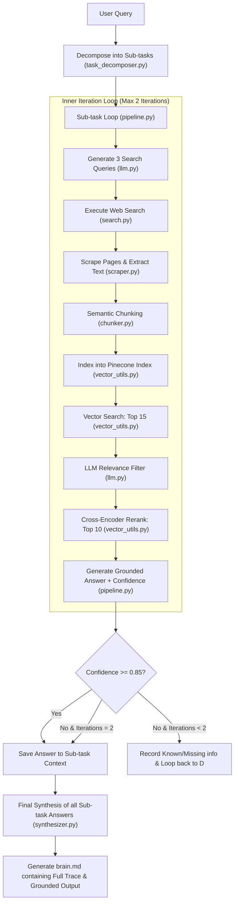

# Deep Research Pipeline (Perplexity-style Agentic Search)

An advanced, production-grade agentic research pipeline that decomposes complex user queries into targeted sub-tasks, recursively searches and scrapes the web, filters and reranks findings using a two-stage retrieval mechanism, and synthesizes grounded, hallucination-free final answers. 

A full, transparent reasoning trace of each run is captured and saved dynamically to `brain.md`.

---

## ⚙️ Core Configuration & System Parameters

The behavior of the pipeline is governed by concrete hyperparameters defined across the source code.

| Parameter Category | Name | Default Value | Purpose | Code Reference |
| :--- | :--- | :---: | :--- | :--- |
| **Orchestration** | Max Sub-Tasks | `2` | Hard cap on the number of sub-tasks processed per query | [pipeline.py:L271](file:///Users/krishnasurya/Desktop/agent_search/pipeline.py#L271) |
| **Orchestration** | Max Iterations | `2` | Maximum retry/re-search attempts per sub-task if confidence is low | [pipeline.py:L102](file:///Users/krishnasurya/Desktop/agent_search/pipeline.py#L102) |
| **Orchestration** | Confidence Threshold | `0.85` | Confidence score required to accept an answer without retrying | [pipeline.py:L103](file:///Users/krishnasurya/Desktop/agent_search/pipeline.py#L103) |
| **Search** | Queries per Iteration | `3` | Number of targeted search queries generated per loop iteration | [pipeline.py:L29](file:///Users/krishnasurya/Desktop/agent_search/pipeline.py#L29) |
| **Search** | Max Tavily Results | `10` | Number of search results fetched from Tavily per query | [search.py:L15](file:///Users/krishnasurya/Desktop/agent_search/search.py#L15) |
| **Scraping** | Scraper Max Characters | `5000` | Hard limit on webpage characters fetched to prevent token overflow | [scraper.py:L22](file:///Users/krishnasurya/Desktop/agent_search/scraper.py#L22) |
| **Chunking** | Similarity Threshold | `0.5` | Cosine similarity threshold below which sentence boundary splits occur | [chunker.py:L11](file:///Users/krishnasurya/Desktop/agent_search/chunker.py#L11) |
| **Chunking** | Min Chunk Size | `3` | Minimum number of sentences required to keep a chunk separate | [chunker.py:L80](file:///Users/krishnasurya/Desktop/agent_search/chunker.py#L80) |
| **Vector DB** | Embeddings Dim | `384` | Dimensionality of vectors generated by `all-MiniLM-L6-v2` | [vector_utils.py:L11](file:///Users/krishnasurya/Desktop/agent_search/vector_utils.py#L11) |
| **Vector DB** | Vector Search Top-K | `15` | Number of initial vector results fetched from Pinecone | [vector_utils.py:L36](file:///Users/krishnasurya/Desktop/agent_search/vector_utils.py#L36) |
| **Vector DB** | Reranker Top-K | `10` | Maximum final chunks passed to the LLM after filtering & reranking | [vector_utils.py:L31](file:///Users/krishnasurya/Desktop/agent_search/vector_utils.py#L31) |
| **Context Limits** | Max Context Chars | `8000` | Maximum text size sent to the LLM for sub-task answering | [pipeline.py:L178](file:///Users/krishnasurya/Desktop/agent_search/pipeline.py#L178) |
| **Context Limits** | Max Chunk Chars | `1200` | Maximum slice size for individual context chunks in prompts | [pipeline.py:L179](file:///Users/krishnasurya/Desktop/agent_search/pipeline.py#L179) |

---

## 🏗️ System Architecture & Workflow

The pipeline utilizes a multi-layered verification and retrieval flow:



### The Two-Level Loop Structure
1. **Outer Loop**: Iterates through sub-tasks sequentially. Each sub-task receives a summary of confirmed context from preceding sub-tasks, allowing it to build on already discovered knowledge.
2. **Inner Loop**: A confidence-gated retry mechanism. If the response doesn't meet the target confidence (`0.85`), the pipeline isolates what details are missing, rewrites the search queries to target *only* the missing information, and runs a second round of searching and retrieval.

---

## 🛠️ Module Breakdowns

### 1. Orchestration & Coordination
* **`main.py`**: A minimal entry point specifying the query and initializing the pipeline execution.
* **`pipeline.py`**: The central coordinator. Implements the `Pipeline` class. Runs the outer sub-task loop and inner retry loop. Contains logic to aggregate chunks, format prompts, track memory, and invoke APIs.

### 2. Task Decomposition
* **`task_decomposer.py`**: Prompts the LLM to analyze the initial user request and split it into discrete, answerable sub-questions. It implements a hard cap of 2 sub-tasks for focused lookup.

### 3. Search & Scraping
* **`search.py`**: Executes structured queries using the Tavily Search API. Protects quality by excluding non-informative or paywalled academic domains like `sciencedirect.com`, `jamanetwork.com`, and `academic.oup.com`.
* **`scraper.py`**: Fetches webpages via `requests`. Decomposes boilerplate code (`script`, `nav`, `style`, `footer`) using `BeautifulSoup`. Features a fallback path to Tavily's extraction engine if raw scraping is blocked.

### 4. Semantic Chunking
* **`chunker.py`**: A highly mathematical segmenter.
  * Splits page content into sentences.
  * Uses `all-MiniLM-L6-v2` to vectorize sentences and computes the cosine similarity between adjacent sentences:
    $$\text{Similarity} = \frac{\vec{a} \cdot \vec{b}}{\|\vec{a}\| \|\vec{b}\| + 10^{-10}}$$
  * Inserts chunk boundaries when the similarity falls below `0.5`.
  * Automatically merges micro-chunks containing fewer than 20 words to preserve context.

### 5. Vector Storage & Reranking
* **`vector_utils.py`**: Manages vector logic.
  * Embeds text chunks via `all-MiniLM-L6-v2` (384 dimensions) and inserts them into a Pinecone index under isolated run namespaces (`{run_id}_{hash(subtask)}`).
  * Runs a two-stage retrieval process:
    1. **Vector Stage**: Fetches top 15 candidates.
    2. **Filtering Stage**: Leverages the LLM (`filter_chunks` in `llm.py`) to drop off-topic or noisy matches.
    3. **Reranking Stage**: Reranks the remaining candidates using `cross-encoder/ms-marco-MiniLM-L-6-v2` to ensure the most relevant content matches the query exactly.

### 6. LLM Core Utilities
* **`llm.py`**: Consolidates all LLM helper calls. Uses OpenRouter to serve `nvidia/nemotron-3-nano-30b-a3b:free`. Includes:
  * `classify_niche`: Evaluates query specificity to adjust query parameters.
  * `decompose`: Generates multiple sub-queries.
  * `rank`: Reranks initial titles and URLs.
  * `filter_chunks`: LLM relevance evaluator for context chunks.
  * `_extract_json`: A robust JSON parser that extracts correctly formed structures even when models prepend explanation or reasoning text.

### 7. Synthesizer
* **`synthesizer.py`**: Compiles the final response. It enforces strict grounding contracts: it is prohibited from using outside parametric knowledge, must explicitly cite sources, and must flag unverified sub-tasks instead of guessing.

---

## 🛡️ Robustness & JSON Parsing

Free-tier LLMs frequently violate structured output constraints, prefixing responses with explanations (e.g., *"Sure, here is the JSON you requested..."*). 

To prevent runtime crashes, `llm.py` features a robust character-by-character scanner utilizing a JSON Decoder:

```python
def _extract_json(raw: str, validate=None):
    decoder = json.JSONDecoder()
    idx, n = 0, len(raw)
    while idx < n:
        if raw[idx] in '{[':
            try:
                obj, end = decoder.raw_decode(raw, idx)
            except json.JSONDecodeError:
                idx += 1
                continue
            if validate is None or validate(obj):
                return obj
            idx = end
        else:
            idx += 1
    raise json.JSONDecodeError("No JSON found matching expected shape", raw, 0)
```

### Key Engineering Guardrails
1. **Namespace Isolation**: Each execution generates a unique `run_id` (e.g., `run_1722180000`). Chunks upserted into Pinecone are isolated in namespaces unique to that run and sub-task, eliminating database cross-talk.
2. **Defensive API Wrappers**: Centralized `_safe_completion` handles API timeouts and server errors gracefully, returning `None` instead of crashing the pipeline.
3. **Domain Blacklists**: Prevents the agent from getting stuck on paywalled journals or interactive platforms (Reddit, YouTube, Wikipedia portals).

---

## 🛠️ Setup & Execution

### 1. Prerequisites & Dependencies

Create a virtual environment and install the required libraries:

```bash
# Set up virtual environment
python3 -m venv venv
source venv/bin/activate

# Install dependencies
pip install beautifulsoup4 numpy sentence-transformers pinecone-client python-dotenv openai tavily-python
```

### 2. Environment Variables

Create a `.env` file in the root directory:

```env
OPENROUTER_API_KEY=your_openrouter_api_key
TAVILY_API_KEY=your_tavily_api_key
PINECONE_API_KEY=your_pinecone_api_key
```

> [!IMPORTANT]
> The vector database requires a Pinecone index named `"perplexity"` configured with **384 dimensions** (matching `all-MiniLM-L6-v2`) and the **cosine** metric.

### 3. Execution

Execute the pipeline via the main entry point:

```bash
python3 main.py
```

Upon completion, check `brain.md` for the full query evaluation path, retrieval logs, and the final synthesized response.
